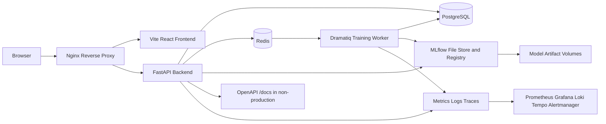
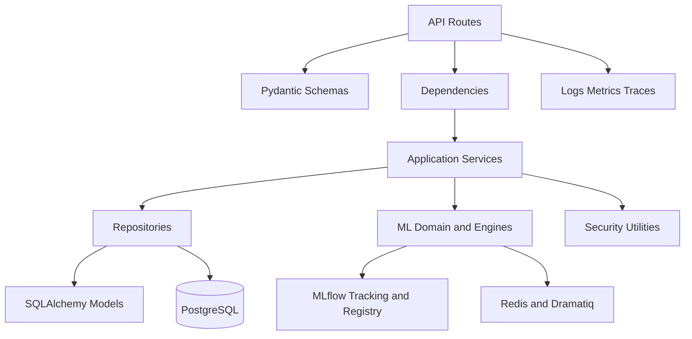
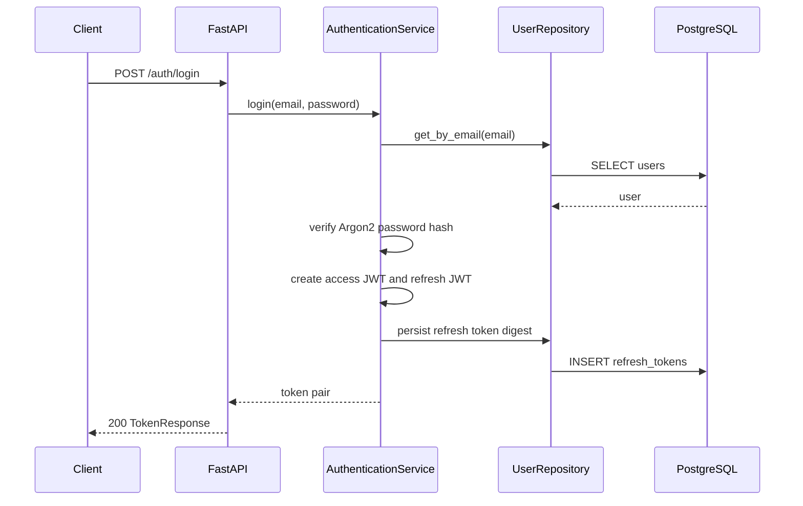
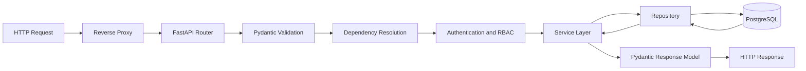
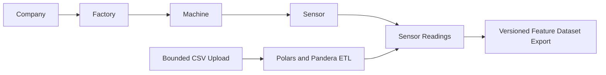
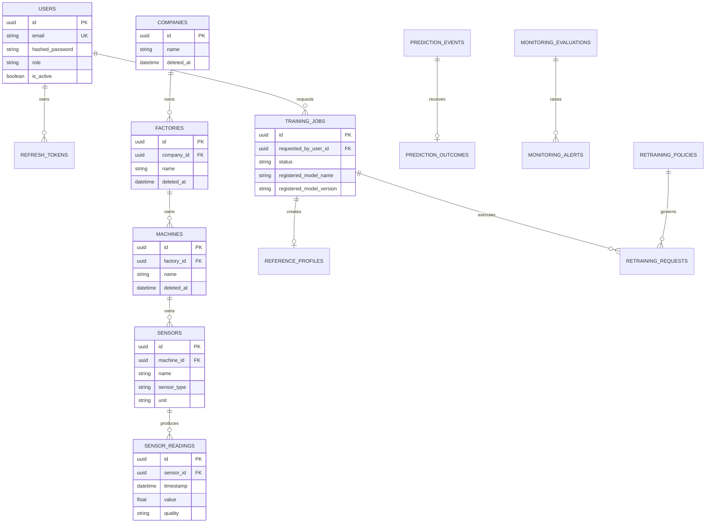
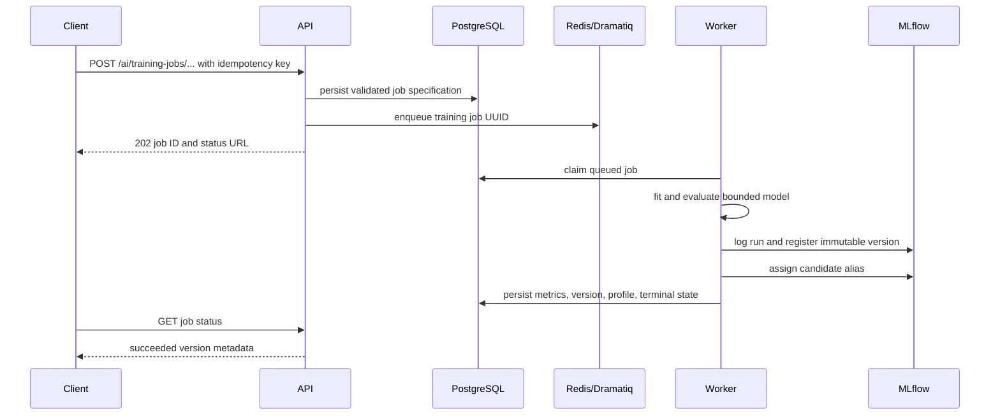
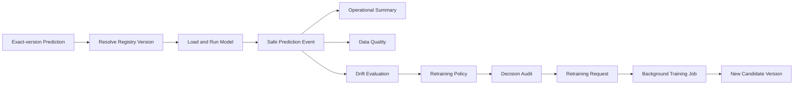
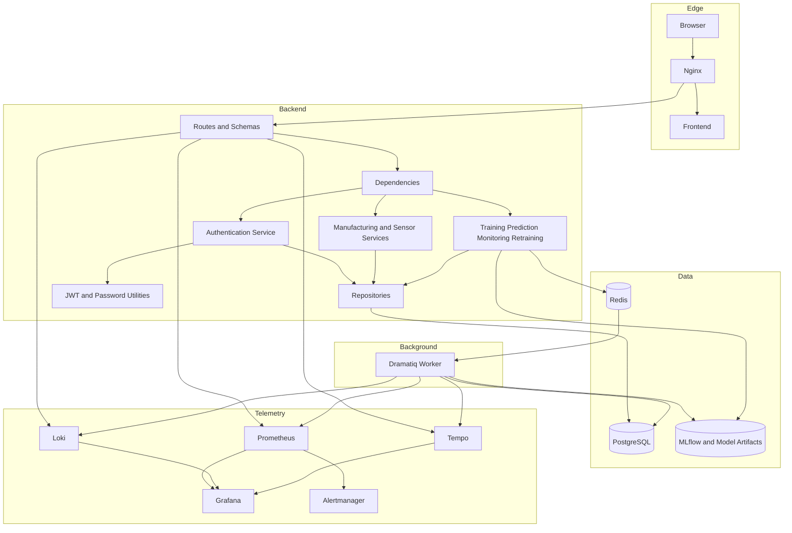
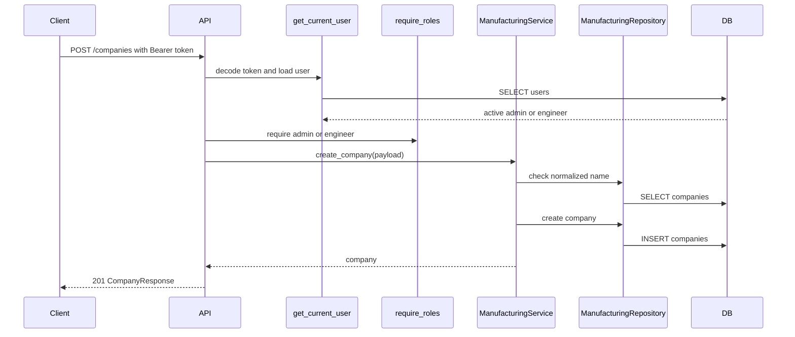

# Architecture

This document describes the AI Manufacturing Platform for the v1.0 release.

## Current v1.0 Overview

The platform is a Docker Compose monorepo for authenticated manufacturing data
and governed local machine-learning workflows. It combines a lightweight Vite
React frontend, an Nginx production entry point, a FastAPI backend, PostgreSQL,
Redis-backed Dramatiq workers, MLflow model tracking and registration, bounded
prediction monitoring and controlled retraining, and an optional local
observability stack.

The supported AI scope is intentionally narrow: Random Forest regression and
integer-label classification, immutable registered model versions, explicit
promotion, exact-version prediction, privacy-preserving monitoring summaries,
and policy-controlled candidate retraining. It does not provide automatic model
promotion, prediction probabilities, RAG, computer vision, MQTT, or Kafka.

## Overall Architecture

The backend implements authentication, user management, RBAC, companies,
factories, machines, sensors, sensor readings, CSV ingestion, feature dataset
exports, MLOps metadata, AI training jobs, model governance, prediction,
monitoring, drift analysis, outcomes, and controlled retraining. PostgreSQL is
the system of record for application and workflow state. Redis provides rate
limiting and background queues. MLflow and local artifact volumes hold tracked
runs, registered versions, and fitted model files.

## System Diagram



In local development, the Vite server and backend publish localhost ports
directly. In production, only Nginx publishes the public port; application, data,
and optional observability traffic remain on isolated Compose networks.

## Monorepo Architecture

```text
ai-manufacturing-platform/
  backend/          FastAPI service, Alembic migrations, ML services, tests
  frontend/         Vite React TypeScript application
  docker/           Backend and frontend Dockerfiles
  docs/             Architecture, API, operations, release, and runbook docs
  infrastructure/   Nginx and local observability configuration
  ml/               Local model artifacts and MLOps configuration boundary
  datasets/         Local bounded dataset boundary
  examples/         Validated AI training and prediction payloads
  performance/      Opt-in bounded k6 smoke and load scenarios
  scripts/          Development, demo, backup, deployment, and verification tools
  .github/workflows Continuous integration configuration
```

The top-level directories separate application runtime code from data, model,
deployment, observability, performance, and documentation concerns. ML training,
sensor ingestion, registered prediction, monitoring, and retraining are now
implemented inside the backend and supporting runtime assets; the `ml/` and
`datasets/` directories remain storage and configuration boundaries rather than
independent services.

## Backend Clean Architecture

The backend separates transport, validation, use cases, persistence, ML domain
logic, and infrastructure adapters:

- `app/api`: FastAPI routers and HTTP translation only.
- `app/schemas`: Pydantic v2 request and response contracts.
- `app/services`: authentication, manufacturing, sensor, ETL, and feature
  application use cases.
- `app/repositories`: SQLAlchemy persistence adapters for domain and workflow
  state.
- `app/models`: SQLAlchemy ORM mappings and persisted enums.
- `app/dependencies`: FastAPI dependency injection and runtime composition.
- `app/ml/domain`: trainer identities, task types, and immutable domain records.
- `app/ml/engine`, `metrics`, and `trainers`: fitting and evaluation logic.
- `app/ml/jobs`: persisted specifications, Redis/Dramatiq queue adapters, worker
  execution, retries, and reconciliation.
- `app/ml/registry`, `tracking`, and `artifacts`: MLflow registration, run
  tracking, and local model persistence boundaries.
- `app/ml/monitoring`, `promotion`, and `retraining`: safe prediction events,
  drift, explicit alias governance, policies, audits, and candidate workflows.
- `app/observability`: structured logging, metrics, tracing, and context
  propagation.
- `app/utils`: JWT, password hashing, timestamps, and security helpers.



Routes depend on interfaces and composed services rather than embedding database,
MLflow, queue, or fitting behavior. This keeps synchronous HTTP concerns separate
from persisted background execution and external adapter failure handling.

## Frontend Architecture

The frontend is a TypeScript React app built with Vite. React Router owns
routing, TailwindCSS owns styling, and the Dashboard at `/` provides the current
landing experience. In development it includes a local demo card linking to the
API documentation. Complete manufacturing and AI workflows remain API-first and
are available through authenticated endpoints and non-production Swagger UI.

The production image compiles static assets and serves them through Nginx. The
reverse proxy routes API traffic to FastAPI while keeping backend, PostgreSQL,
Redis, workers, and observability services off public host ports.

## Authentication Flow



Access tokens are bearer JWTs. Refresh tokens are JWTs whose SHA-256 digests are
persisted so they can be rotated and revoked. Current-user resolution reloads the
active user, and `require_roles` enforces administrator, engineer, or operator
permissions at the route boundary. Authentication rate limits use Redis and fail
open with bounded operational telemetry if the limiter is unavailable.

## Dependency Injection

FastAPI dependency injection composes the runtime graph:

- `get_settings` loads typed Pydantic settings.
- `get_db_session` yields an async SQLAlchemy session.
- Repository dependencies provide request-scoped persistence adapters.
- Authentication, manufacturing, sensor-data, feature, MLOps, monitoring,
  promotion, and retraining dependencies compose their application services.
- Queue dependencies provide Redis/Dramatiq adapters without exposing payloads to
  the broker; only persisted job identifiers are enqueued.
- ML dependencies compose trainer registries, tracking, artifacts, registered
  model loaders, and monitored prediction services.
- `get_current_user` validates bearer access tokens and loads the active user.
- `require_roles` enforces RBAC.

Settings are injectable through the application factory, which keeps tests
isolated and permits deterministic SQLite, temporary MLflow, and temporary
artifact fixtures without changing production composition.

## Request Flow



Request and correlation IDs are validated at the boundary, returned in response
headers, propagated to background messages, and emitted in structured logs and
traces. Normalized route templates and bounded dimensions prevent identifiers or
payload values from becoming metric labels.

## Manufacturing and Sensor Data Flow



Manufacturing entities use UUIDs and soft deletion. Sensor readings are validated
against active sensors, normalized to UTC, and can be created individually or by
bounded CSV ingestion. Feature engineering exports versioned Parquet datasets;
it does not create an online feature store.

## Database Architecture

The backend uses SQLAlchemy 2.0 ORM models and Alembic migrations. Persisted
areas include:

- users and refresh-token digests;
- companies, factories, machines, sensors, upload jobs, and sensor readings;
- experiments, training runs, and model artifact metadata;
- background training jobs and model-promotion audits;
- prediction events, reference profiles, monitoring evaluations and alerts;
- prediction outcomes and controlled retraining policies, requests, audits, and
  candidate comparisons.

Manufacturing entities use UUID primary keys, `created_at`, `updated_at`, and
nullable `deleted_at` values for soft deletion. AI workflow tables preserve
ownership, idempotency, safe error codes, exact model-version lineage, and
append-only governance evidence where required.



## Background Training and Model Lifecycle



The queue carries only a job identifier; the validated training specification is
stored in PostgreSQL. Workers run one process and one thread by default, persist
attempt state, retry bounded transient failures, and reconcile stale or orphaned
jobs. Completion assigns only `candidate`. Challenger and champion aliases require
explicit policy evaluation and audited authorized requests.

MLflow uses a local file tracking store in the current Compose topology. Model
metadata and fitted artifacts reside on named volumes shared by the backend and
worker. These volumes survive container replacement but are not backups and do
not provide cross-host availability.

## Prediction, Monitoring, and Controlled Retraining



Prediction resolves one exact registered version or an existing alias and checks
the protected trainer identity before loading the model. Monitoring persists
request shape, duration, status, bounded feature statistics, and bounded output
summaries rather than raw feature matrices or predictions. Exact-version
reference profiles support operational, data-quality, and drift reports with
explicit sample limits and truncation signals.

Controlled retraining is never triggered by ordinary prediction. An explicit
evaluation applies configured drift thresholds, cooldowns, quotas, active-request
limits, trusted source-job lineage, and truncation policy. Eligible requests reuse
the persisted source specification to create a background candidate. Candidate
comparison is advisory; promotion remains a separate governed operation.

## Docker Architecture

Docker Compose defines the core runtime:

- `backend`: FastAPI served by Uvicorn.
- `training-worker`: single-process, single-thread Dramatiq worker.
- `frontend`: Vite development server locally; static Nginx image in production.
- `nginx`: production reverse proxy and only public application port.
- `postgres`: PostgreSQL 16 application and workflow state.
- `redis`: Redis queue, rate-limit, and recovery boundary.

The optional `observability` profile adds PostgreSQL and Redis exporters,
cAdvisor, Prometheus, Alertmanager, Loki, Alloy, Tempo, and Grafana. Named volumes
persist database, Redis, MLflow, model artifacts, and telemetry data. Backend
configuration is injected through typed environment variables documented in
`.env.example`; production uses a separate ignored environment file.

## Component Diagram



## Manufacturing Sequence Diagram



## Observability Architecture

FastAPI and worker processes emit bounded Prometheus metrics, structured JSON
logs, and OpenTelemetry traces. Request and correlation IDs connect HTTP and
background activity without turning user, job, model, or payload identifiers into
metric labels. Alloy collects Docker logs for Loki, and OTLP/gRPC exports traces
to Tempo. Grafana is provisioned with Prometheus, Loki, and Tempo datasources and
cross-links among metrics, logs, and traces.

Prometheus evaluates SLO recording rules and alert rules, while Alertmanager
groups and inhibits local notifications. The checked-in configuration has no
external paging destination. Observability is optional in production and should
be enabled only after measuring core resource use on the single host.

## Deployment Boundaries and Limitations

The production configuration targets one Docker host. Nginx isolates the public
edge, while PostgreSQL, Redis, backend, worker, and telemetry services remain on
internal networks. Alembic migrations run as an explicit one-shot deployment
step; ordinary backend and worker startup never applies migrations.

This is not a high-availability architecture. PostgreSQL, Redis, MLflow,
artifacts, and telemetry remain on host-local volumes. HTTPS certificate
automation, managed secrets, off-host state, automatic failover, external paging,
container publishing, and production-scale capacity evidence are outside the v1.0
release. The backup, deployment, rollback, observability, and incident runbooks in
`docs/` define the supported operational procedures and safeguards.
