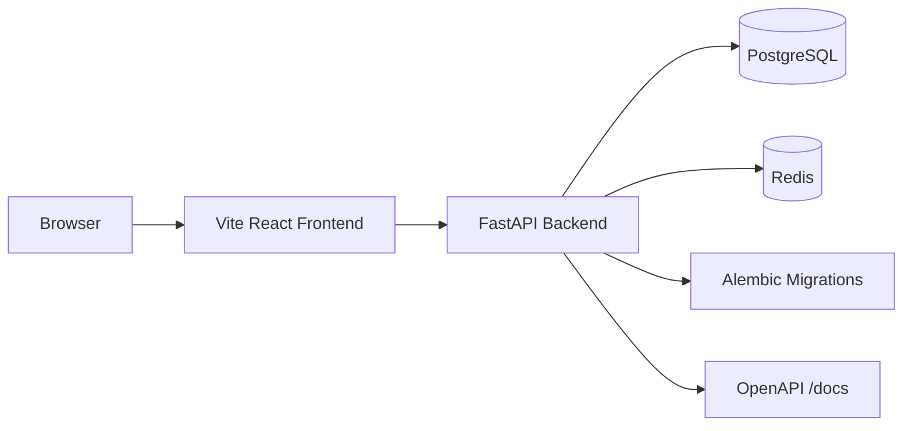
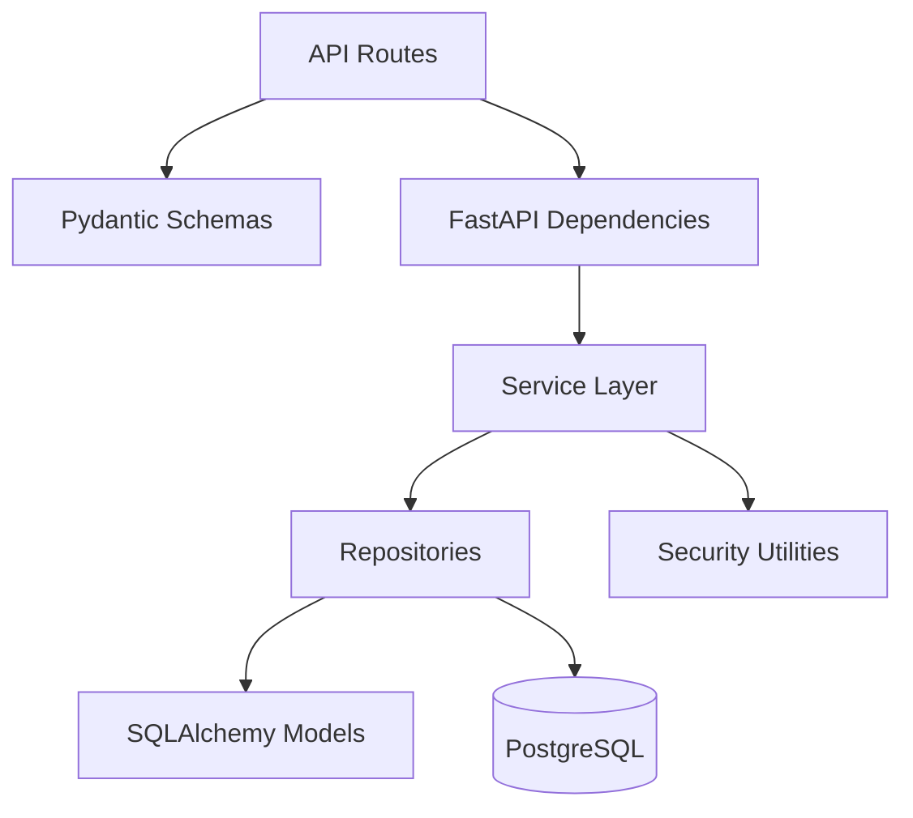
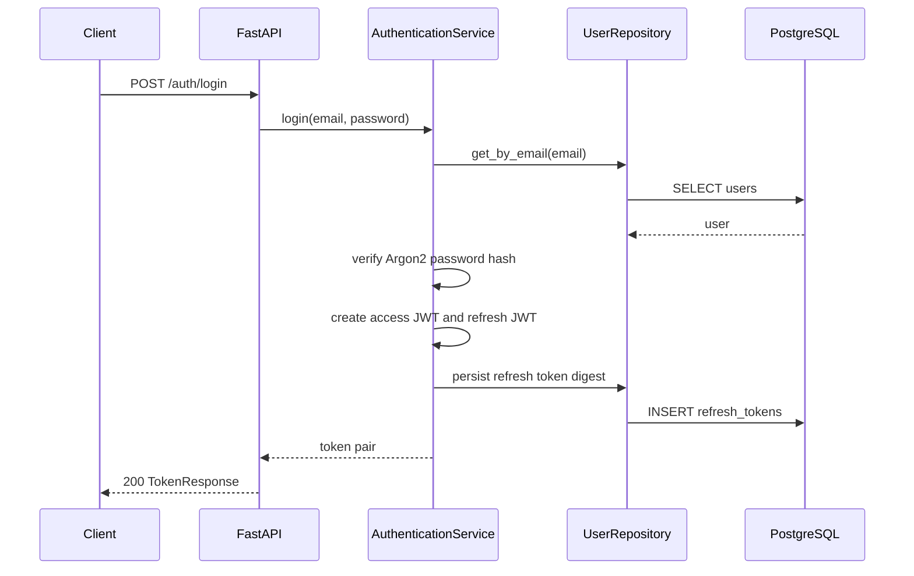
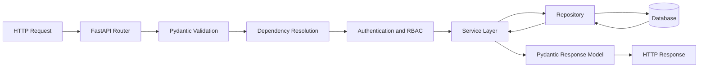
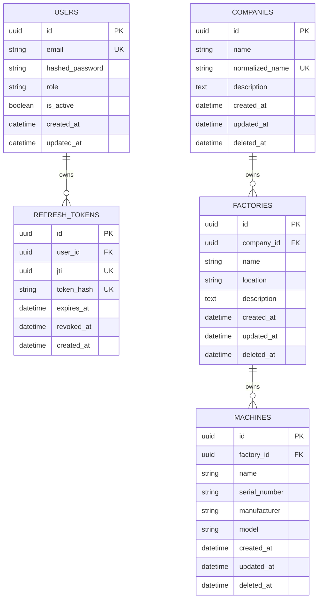
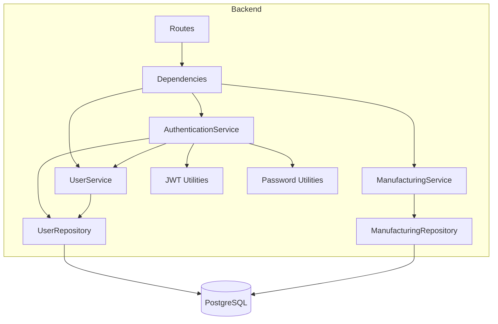
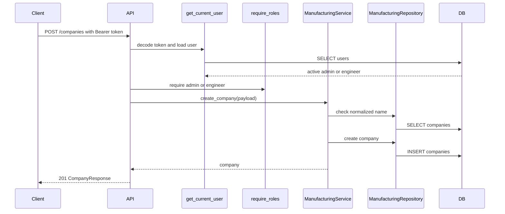

# Architecture

This document describes the AI Manufacturing Platform as of version `0.3.0`.

## Overall Architecture

The platform is a monorepo with a FastAPI backend, Vite React frontend, PostgreSQL database, Redis cache boundary, Docker runtime assets, and engineering documentation. The backend currently implements authentication, user management, RBAC, and the core manufacturing domain: companies, factories, and machines.

## System Diagram



## Monorepo Architecture

```text
ai-manufacturing-platform/
  backend/          FastAPI service, Alembic migrations, backend tests
  frontend/         Vite React TypeScript application
  docker/           Backend and frontend Dockerfiles
  docs/             Engineering documentation
  infrastructure/   Future infrastructure-as-code boundary
  ml/               Future ML boundary
  datasets/         Future dataset boundary
  scripts/          Developer automation
```

The top-level directories intentionally separate product runtime code from future ML, dataset, and infrastructure work. Sprint 3 does not implement ML, sensor ingestion, prediction, RAG, or computer vision.

## Backend Clean Architecture

The backend separates transport, validation, use cases, persistence, and infrastructure:

- `app/api`: FastAPI routes.
- `app/schemas`: Pydantic v2 request and response models.
- `app/services`: application use cases for auth, users, and manufacturing.
- `app/repositories`: SQLAlchemy persistence adapters.
- `app/models`: SQLAlchemy ORM models.
- `app/dependencies`: FastAPI dependency injection.
- `app/utils`: JWT, password hashing, and security helpers.



## Frontend Architecture

The frontend is a TypeScript React app built with Vite. React Router owns routing, TailwindCSS owns styling, and the current page is the Dashboard at `/`. The frontend has not yet integrated the Sprint 3 backend APIs.

## Authentication Flow



Access tokens are bearer JWTs. Refresh tokens are JWTs whose SHA-256 digests are persisted so refresh tokens can be rotated and revoked.

## Dependency Injection

FastAPI dependency injection composes the runtime graph:

- `get_settings` loads typed Pydantic settings.
- `get_db_session` yields an async SQLAlchemy session.
- `get_user_repository` and `get_manufacturing_repository` inject persistence.
- `get_user_service`, `get_authentication_service`, and `get_manufacturing_service` inject use cases.
- `get_current_user` validates bearer access tokens and loads the active user.
- `require_roles` enforces RBAC.

## Request Flow



## Database Architecture

The backend uses SQLAlchemy 2.0 ORM models and Alembic migrations. Current tables:

- `users`
- `refresh_tokens`
- `companies`
- `factories`
- `machines`

Manufacturing entities use UUID primary keys, `created_at`, `updated_at`, and nullable `deleted_at` for soft delete support.



## Docker Architecture

Docker Compose defines:

- `backend`: FastAPI served by Uvicorn.
- `frontend`: Vite development server.
- `postgres`: PostgreSQL 16.
- `redis`: Redis 7 cache boundary.

Backend configuration is injected through environment variables documented in `.env.example`.

## Component Diagram



## Sequence Diagram


