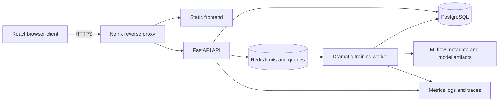

# Commercial and technical handoff

## Release status

The repository is **staging-ready**. Customer delivery and public exposure remain
conditional on deployment-specific security review, customer-owned secret/TLS setup,
real staging acceptance, license review, and the limitations below. This is a technical
status, not a compliance or legal certification.

> **Commercial handoff blocker:** this repository has no `LICENSE` file or other
> repository-level ownership grant. The owner and qualified legal counsel must supply
> the ownership and licensing terms before any sale, source transfer, or redistribution.
> This documentation records technical evidence only and does not infer legal rights.

## Supported product scope

The platform supports account authentication and three roles; company/factory/machine/
sensor hierarchy; manual and CSV sensor ingestion; bounded asynchronous Random Forest
training; model versions and governed aliases; prediction and privacy-conscious event
history; monitoring evaluations, drift, alerts, observed outcomes, controlled retraining;
and partial domain audit records. Settings are limited to persistent browser appearance
and read-only account information.

It does not provide customer billing, tenant provisioning, MFA, password reset, universal
audit capture, row-level CSV rejection reasons, a general-purpose model marketplace,
arbitrary algorithms, automatic infrastructure deployment, or compliance certification.

## Architecture and trust boundaries

The frontend owns presentation and session coordination; backend authorization remains
authoritative. SQLAlchemy repositories isolate persistence. Alembic applies ordered,
transactional schema migrations. Dramatiq messages contain stable job identifiers rather
than datasets. The worker claims persisted work before execution and emits an expiring
Redis heartbeat. See [architecture](architecture.md) and the architecture decision records.

## Authorization summary

| Capability                            | Admin | Engineer |   Operator |
| ------------------------------------- | ----: | -------: | ---------: |
| Read hierarchy and sensor data        |   Yes |      Yes |        Yes |
| Create/update hierarchy               |   Yes |      Yes |         No |
| Administrative deletion               |   Yes |       No |         No |
| Train and govern models               |   Yes |  Limited |         No |
| Execute prediction                    |   Yes |      Yes |        Yes |
| Prediction history                    |   Yes |      Yes | Restricted |
| Alert acknowledge                     |   Yes |      Yes |         No |
| Alert resolve / policy administration |   Yes |       No |         No |
| Partial audit sources                 |   Yes |  Limited |         No |

Exact route permissions in backend dependencies are authoritative; hidden controls alone
are never the security boundary.

## Security and privacy controls

Passwords use the repository password hasher (Argon2 through pwdlib). Short-lived access
tokens and persisted, rotating refresh-token hashes are issuer/audience validated.
Production requires explicit CORS origins, disabled API documentation, TLS termination,
security headers, CSP, and injected secrets. Logs use bounded structured fields and must
not contain tokens, passwords, CSV bodies, feature matrices, or connection URLs.

Anonymous auth limits are IP/path-keyed through an HMAC. Sensitive authenticated
mutations are user/path-keyed, distributed through Redis, default to 30 requests per 60
seconds, expire automatically, and fail closed if the limiting store is unavailable.
Read-only routes remain available during worker outages. Queued training/retraining
submissions require Redis and a fresh real-worker heartbeat.

Backups contain customer data and must be encrypted, access-controlled, retained, and
destroyed under the customer’s policy. The included scripts provide integrity and restore
verification, not storage encryption or off-site custody.

## Deployment and operations

- Local development: [development guide](development.md).
- Disposable staging validation: `scripts/staging-local.sh start`, then `seed`, browser
  E2E, smoke tests, `stop`, and explicitly owned `clean` when approved.
- Production: [Google Cloud production deployment](google-cloud-production-deployment.md)
  and [HTTPS](production-https.md).
- Health: `/health` is liveness, `/ready` is PostgreSQL readiness, and
  `/operational-status` reports sanitized asynchronous dependency state.
- Backup/restore: [disaster recovery](backups-and-disaster-recovery.md).
- Rollback and release decisions: [release readiness](release-readiness.md) and the
  [release checklist](release-checklist.md).
- Observability and incident response: [platform observability](platform-observability.md)
  and `docs/runbooks/`.

Scaling requires shared PostgreSQL, Redis, and artifact storage; multiple stateless API
replicas; deliberate worker concurrency; queue-depth alerting; and customer-specific load
tests. Local filesystem artifacts are not a multi-host production artifact strategy.

## Dependency and license due diligence

No repository `LICENSE` file is present. Ownership and redistribution terms therefore
require human legal resolution before transfer. The lockfiles and `pyproject.toml` are the
authoritative dependency inventories; CI runs `npm audit`, `pip check`, and `pip-audit`.
Core runtime families include React, Vite, FastAPI, SQLAlchemy, PostgreSQL drivers,
Redis/Dramatiq, scikit-learn, Polars, Pandera, Optuna, MLflow, OpenTelemetry, Nginx,
PostgreSQL, Redis, Prometheus, Grafana, Loki, Tempo, and Alloy.

This document does not grant or interpret licenses. A buyer must generate a complete
software-bill-of-materials/license report for the exact shipped images and review all
direct and transitive terms, particularly database/observability images and ML tooling.
The development-only Black 24 formatter has two explicitly tracked 2026 advisories;
upgrading requires a separately reviewed repository-wide formatting migration because
the fixed major currently fails equivalence checking on an existing monitoring module.
It is not installed in the production image.
The FK login PNG, FK name/monogram, icons, fonts, sample data names, and any trained-model
inputs have no provenance evidence in the repository and require owner confirmation.

### Asset and dependency provenance inventory

| Item                                  | Repository path or package                                                                                 | Current known source                                                                                          | License evidence present                              | Commercial review required          |
| ------------------------------------- | ---------------------------------------------------------------------------------------------------------- | ------------------------------------------------------------------------------------------------------------- | ----------------------------------------------------- | ----------------------------------- |
| FK SOLUTIONS logo/monogram/name image | `frontend/src/assets/fk-login-background.png`                                                              | Repository asset; original source is not recorded                                                             | No                                                    | Yes                                 |
| Login industrial background           | `frontend/src/assets/fk-login-background.png`                                                              | Same combined repository asset; original source is not recorded                                               | No                                                    | Yes                                 |
| Interface icons                       | `frontend/src/components/Icon.tsx`                                                                         | Inline SVG path data committed in the repository; original design source is not recorded                      | No                                                    | Yes                                 |
| Fonts                                 | CSS system stack in `frontend/src/styles/index.css`                                                        | User/device system fonts; no font files are distributed by the repository                                     | Not applicable in repository                          | Yes, for customer brand/font policy |
| Demo sample dataset                   | Deterministic values in `scripts/seed_demo.py`                                                             | Repository-authored fixture according to current repository evidence; contributor ownership is not documented | No                                                    | Yes                                 |
| CSV fixtures                          | Inline CSV strings in `backend/tests/test_sensor_data_etl.py` and related tests                            | Repository test fixtures; contributor ownership is not documented                                             | No                                                    | Yes                                 |
| Model-training fixtures               | `backend/tests/ai_api_support.py`, `backend/tests/test_end_to_end_workflow.py`, and `scripts/seed_demo.py` | Small synthetic numeric matrices committed in the repository; contributor ownership is not documented         | No                                                    | Yes                                 |
| Third-party frontend libraries        | `frontend/package-lock.json`                                                                               | npm registry packages listed in the lockfile                                                                  | Package metadata only; no repository inventory report | Yes                                 |
| Third-party backend libraries         | `backend/pyproject.toml` and `backend/requirements/base.txt`                                               | Python packages from the configured package index                                                             | Package metadata only; no repository inventory report | Yes                                 |
| Runtime service images                | Compose image declarations                                                                                 | PostgreSQL, Redis, Nginx, Prometheus/Grafana/Loki/Tempo/Alloy and exporter images                             | Upstream image metadata only                          | Yes                                 |

Before sale, obtain signed IP ownership confirmation, contributor assignment
confirmation, dependency-license review, asset-license review, a customer contract that
defines source-code transfer or license terms, and evidence that all delivery credentials
have been removed or rotated.

External dependencies are container registries and, when configured, customer-managed
DNS/TLS, PostgreSQL, Redis, artifact storage, and telemetry destinations. AWS is not
required by the repository’s verified local or documented Google Cloud path.

## Customer handover checklist

1. Resolve repository license and brand/asset provenance.
2. Approve the supported/unsupported scope and role matrix.
3. Supply customer-owned domains, TLS, secret store, backups, retention, and alert routes.
4. Validate production Compose and immutable image digests.
5. Run migrations, real-role browser acceptance, smoke, backup/restore, and rollback drill.
6. Review dependency/SBOM output and vulnerability exceptions.
7. Establish SLO ownership, incident contacts, access reviews, and key rotation.
8. Record accepted limitations and customer-specific scaling/load evidence.

Production backend, worker, and migration images run as UID/GID `10001:10001`.
Their root filesystem is read-only; `/tmp` is an ephemeral tmpfs and the MLflow,
model-artifact, and AI-artifact volumes are the only persistent writable paths. Production
frontend and reverse-proxy images use the upstream unprivileged Nginx UID/GID `101:101`,
with a read-only root filesystem and ephemeral `/tmp`. Existing artifact volumes created
by older root-running releases must be backed up and have ownership migrated deliberately
before upgrade; do not use broad world-writable permissions.
