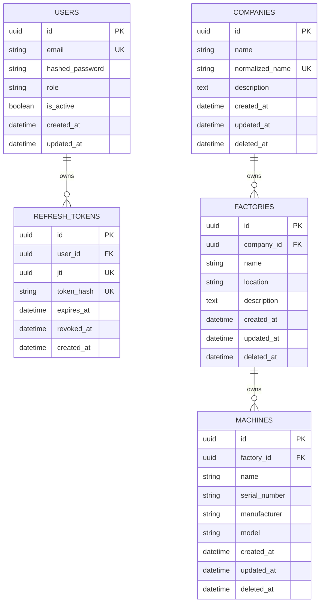

# Database Documentation

This document describes the database schema in version `0.3.0`.

## Migration Strategy

Schema changes are managed with Alembic. Migrations live in `backend/alembic/versions`.

Current migration chain:

- `0001_create_users_and_refresh_tokens`
- `0002_create_manufacturing_domain`

Run migrations:

```bash
cd backend
alembic upgrade head
```

## Users Table

Table: `users`

Purpose: stores authenticated platform users.

Columns:

- `id`: UUID primary key.
- `email`: normalized email address.
- `hashed_password`: Argon2 password hash.
- `role`: `admin`, `engineer`, or `operator`.
- `is_active`: active account flag.
- `created_at`: creation timestamp.
- `updated_at`: last update timestamp.

Indexes and constraints:

- Primary key on `id`.
- Unique index `ix_users_email` on `email`.
- Check constraint `ck_users_role_valid`.

## Refresh Tokens Table

Table: `refresh_tokens`

Purpose: stores refresh-token metadata for rotation and revocation.

Columns:

- `id`: UUID primary key.
- `user_id`: foreign key to `users.id`.
- `jti`: JWT ID claim from the refresh token.
- `token_hash`: SHA-256 digest of the refresh token.
- `expires_at`: refresh-token expiration timestamp.
- `revoked_at`: nullable revocation timestamp.
- `created_at`: creation timestamp.

Indexes and constraints:

- Primary key on `id`.
- Foreign key from `user_id` to `users.id` with cascade delete.
- Unique index `ix_refresh_tokens_jti`.
- Unique index `ix_refresh_tokens_token_hash`.
- Index `ix_refresh_tokens_user_id`.

## Companies Table

Table: `companies`

Purpose: stores manufacturing company records.

Columns:

- `id`: UUID primary key.
- `name`: display name.
- `normalized_name`: normalized name used for uniqueness.
- `description`: optional long-form description.
- `created_at`: creation timestamp.
- `updated_at`: last update timestamp.
- `deleted_at`: nullable soft-delete timestamp.

Indexes and constraints:

- Primary key on `id`.
- Unique index `ix_companies_normalized_name`.
- Index `ix_companies_name`.
- Index `ix_companies_deleted_at`.

## Factories Table

Table: `factories`

Purpose: stores factories that belong to companies.

Columns:

- `id`: UUID primary key.
- `company_id`: foreign key to `companies.id`.
- `name`: factory name.
- `location`: optional location.
- `description`: optional long-form description.
- `created_at`: creation timestamp.
- `updated_at`: last update timestamp.
- `deleted_at`: nullable soft-delete timestamp.

Indexes and constraints:

- Primary key on `id`.
- Foreign key from `company_id` to `companies.id` with `RESTRICT`.
- Index `ix_factories_company_id`.
- Index `ix_factories_name`.
- Index `ix_factories_deleted_at`.
- Composite index `ix_factories_company_deleted`.

## Machines Table

Table: `machines`

Purpose: stores machines that belong to factories.

Columns:

- `id`: UUID primary key.
- `factory_id`: foreign key to `factories.id`.
- `name`: machine name.
- `serial_number`: optional serial number.
- `manufacturer`: optional manufacturer.
- `model`: optional model.
- `created_at`: creation timestamp.
- `updated_at`: last update timestamp.
- `deleted_at`: nullable soft-delete timestamp.

Indexes and constraints:

- Primary key on `id`.
- Foreign key from `factory_id` to `factories.id` with `RESTRICT`.
- Index `ix_machines_factory_id`.
- Index `ix_machines_name`.
- Index `ix_machines_serial_number`.
- Index `ix_machines_deleted_at`.
- Composite index `ix_machines_factory_deleted`.

## Relationships

- One user owns many refresh-token records.
- One company owns many factories.
- One factory owns many machines.
- Company soft delete cascades logically to child factories and machines.
- Factory soft delete cascades logically to child machines.


