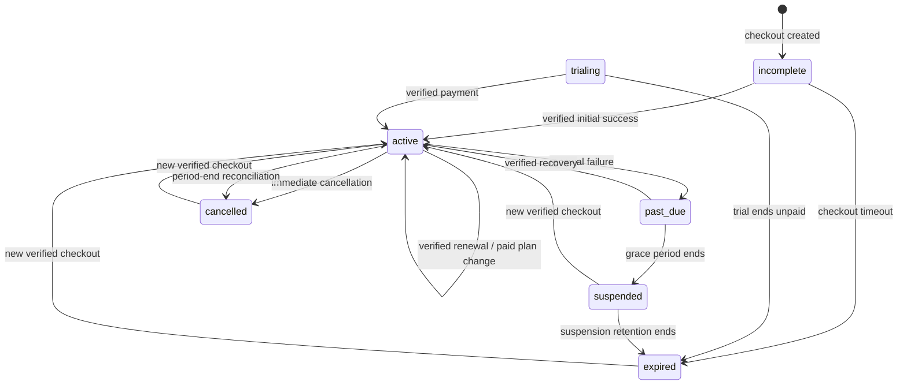

# Subscription lifecycle

The subscription state machine is backend-authoritative. Hosted-checkout creation
may create an `incomplete` subscription, but it never grants paid access. Only a
verified Paymob event whose amount and EGP currency match the backend catalogue
can activate or change a plan.

Period-end cancellation retains access and may be reactivated until the current
period ends. Refund, reversal, and authoritative provider cancellation suspend a
subscription only when they target the latest payment that granted access. The
payment precedence `pending < failed < succeeded < cancelled < reversed <
refunded` prevents delayed lower-precedence events from restoring a terminal
payment. A local abandoned-checkout cancellation may still be superseded by a
verified provider success.

Lifecycle operations lock the company subscription and relevant payment rows,
use versioned updates and database transactions, and write tenant-scoped billing
audit events. Duplicate provider events are durable no-ops. Plan changes keep the
old plan effective until verified payment and start a new monthly period; no
proration is presented because the current provider contract does not expose a
backend-authoritative proration quote.

Temporal policy is configured by `BILLING_GRACE_PERIOD_DAYS`,
`BILLING_INCOMPLETE_EXPIRY_HOURS`, and `BILLING_SUSPENSION_EXPIRY_DAYS`.
Authenticated reads reconcile time-based transitions. See [billing](../billing.md)
for API and provider details.
